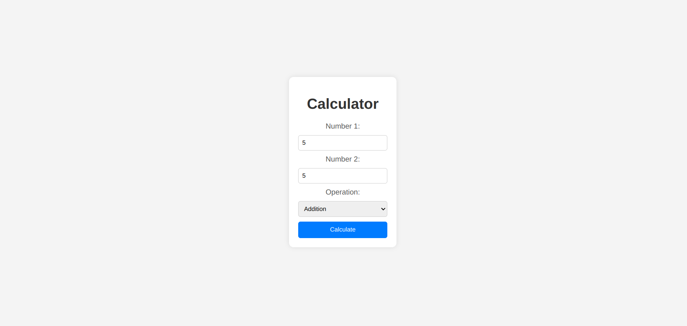

# Calculator Web Application with Flask

This is a straightforward calculator web application built using Flask. It allows users to perform basic arithmetic operations such as addition, subtraction, multiplication, and division.

## Features
- **Functionality:** The calculator supports addition, subtraction, multiplication, and division operations.
- **User Interface:** The user interface is simple and user-friendly, with input fields for numbers and a dropdown menu for selecting the operation.
- **Result Display:** The calculation result is displayed on the same page after submission.

## Screenshots


## Demonstration Video
[Watch the demonstration video](https://drive.google.com/file/d/1SPyHi2hE487acr9A78W6mtCUY-uyIImh/view?usp=drive_link) to see the calculator app in action.

## How to Run
1. Clone the repository to your local machine:

    ```
    git clone https://github.com/your-username/calculator-web-app.git
    ```

2. Navigate to the project directory:

    ```
    cd calculator-web-app
    ```

3. Install the required dependencies:

    ```
    pip install -r requirements.txt
    ```

4. Run the Flask application:

    ```
    python app.py
    ```

5. Open your web browser and go to `http://localhost:5000` to access the calculator.

## Usage
1. Enter the first number in the "Number 1" input field.
2. Enter the second number in the "Number 2" input field.
3. Select the desired operation from the dropdown menu.
4. Click the "Calculate" button.
5. The result will be displayed below the form.

## Repository Structure
- `app.py`: The main Flask application file.
- `templates`: Contains HTML templates for the user interface.
- `static`: Contains static files such as CSS stylesheets and images.
- `README.md`: This file provides information about the application and instructions for running it.
- `requirements.txt`: Lists the required Python packages for running the application.

## Technologies Used
- Flask: Python web framework used for building the application.
- HTML/CSS: For creating the user interface and styling.
- Git: Version control system used for managing the project and hosting it on GitHub.

## Contributors
- Ahmed Samy (@ahmedsamy972)

Feel free to contribute to this project by submitting pull requests or opening issues.

---

This calculator web application was developed by [Ahmed Mohamed](https://github.com/ahmedsamy972). If you have any questions or suggestions, feel free to contact me.

**License:** [MIT License](LICENSE)
